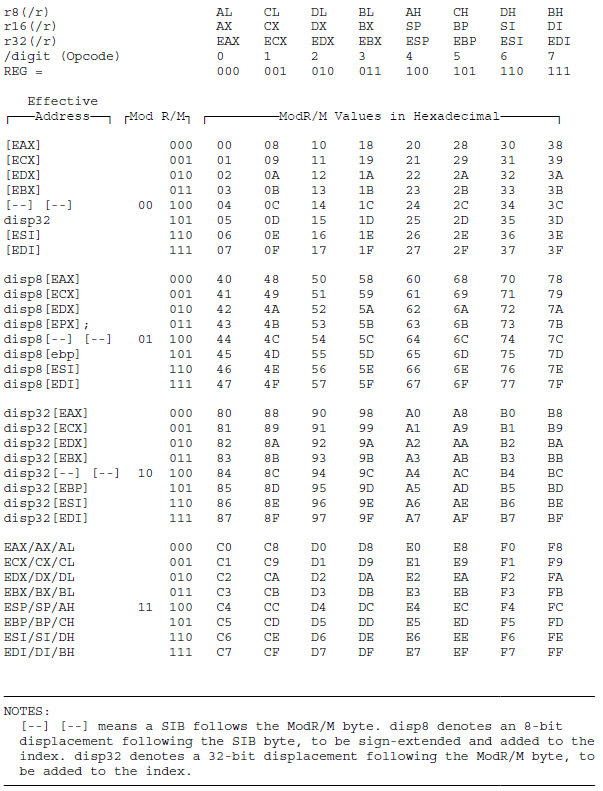

## 作业目标

使用二进制编写并执行一段简单的if-else语句

## 具体要求

请输出以下过程的0-1二进制指令，每个指令占一行
注意，部分指令的组成可能包含ModR/M字段(opcode+ModR/M+displacement+imm)，而prefix和SIB则不会涉及

```
a = 10
b = 40
c = 5
if a > b:
	c = a
else:
	c = b
```

假设内存中的数据段只包含了a b c三个变量(均为32-bits有符号补码)，按顺序连续存储，数据段起始地址保存在ebx中

因为存在多种实现方案，为了避免歧义，请按照以下步骤实现(即完全完成某一步骤之前请勿跳转到下一步骤，即使它们是可交换顺序的)：
1. 按顺序对a、b、c进行内存赋值(在Max.java中实现)
2. 将a、b分别加载到eax ecx(后续步骤在max.txt中实现)
3. 比较a和b的大小
4. 使用JG/JNLE(opcode=0x7f)指令判断是否跳转
5. 对内存中的变量c进行赋值
6. hlt

## 需要实现的指令

1. 0xc7 MOV Ev, Iv

用于对内存中的变量赋值

2. 0x8b MOV Gv, Ev

用于将内存中的值加载到寄存器

3. 0x39 CMP Ev, Gv

注意这里的比较顺序，因为我们指定要求使用JG进行跳转，所以CMP的顺序也是确定的

4. 0x7f	JG/JNLE rel8

5. 0x89 MOV Ev, Gv

6. 0xeb	JMP rel8

用于将寄存器中的值写回内存

## 关于ModR/M

很容易可以查到详细的资料，或者直接翻看i386手册，这里简单总结一下，方便大家理解

1. 指令中的ModR/M(如果有)字段长度为1字节，由三个部分组成：Mod(2-bits)+Reg/Opcode(3-bits)+R/M(3-bits)
2. 本次作业中的补充指令一共涉及到三种类型的操作数：Iv, Ev, Gv，其中v在这里表示操作数长度是32-bits(如果有prefix则v也可以表示64-bits)
3. 如果是Ev和Gv的组合，Mod和R/M共同描述Ev，Reg/Opcode描述Gv
4. 如果是Iv和Gv的组合，Mod和R/M共同描述Ev，Reg/Opcode不起作用
5. 具体描述方式见下图，或者i386手册244页，其中Mod为0b00-0b10表示E操作数在内存，Mod=0b11表示E操作数在寄存器
6. e.g. for Ev： Mod为0b10表示操作数在内存，且displacement字段的长度为32-bits，R/M为0b000表示基地址保存在EAX中，那么这个Ev操作数的内存地址就是EAX中的基地址+displacement字段
7. e.g. for Gv： 下图中上方的表头表示了Reg/Opcode字段的含义，比如Reg/Opcode=0b010表示Gv操作数是EDX寄存器中的值

补充说明：

由于ModR/M的解析较为繁琐，本作业可以不实现下图的表，指令内部可以只考虑程序涉及到的单一情况，比如如果某条指令在执行时只会用到0b11001000一种ModR/M码，那么其他情况可以不用考虑



### 关于读内存

注意使用mmu.read读内存时要求48-bits的逻辑地址作为参数。在本次作业中，你可以不用关心读取的是代码数据还是变量数据，即不用关心使用哪个段寄存器，逻辑地址组成统一为concat(ds, ebx+displacement)，

e.g. 如果你的指令中需要读取某块内存数据，你需要：

1. 从ds段寄存器获取16-bits的段选择符

2. 将指令中的displacement字段和ebx中的数据起始地址相加获得32-bits的偏移量(offset)

3. concat(ds, offset)获得48-bits的逻辑地址，使用mmu.read(addr, 32)读取内存中的变量值

### 测试接口

1. Instruction接口类增加了default String toBinaryStr()接口，这个方法调用Log.write方法保存指令的二进制执行流，测试用例会通过Log.txt检查指令的执行流是否正确，因此请在本次作业涉及到的指令的exec中调用此接口

2. Max.java用于加载和执行你的二进制代码，你需要在这个类中根据ab的传入参数值先生成两条指令，为对应变量的内存区域赋值，然后开始执行max.txt文件中的指令

3. 测试用例实际上已经包含了程序的完整逻辑，你可以直接将其整理成完整的程序，但我们不建议这么做，除非你实在不会，而且考试的时候我们不会提供显式的测试用例